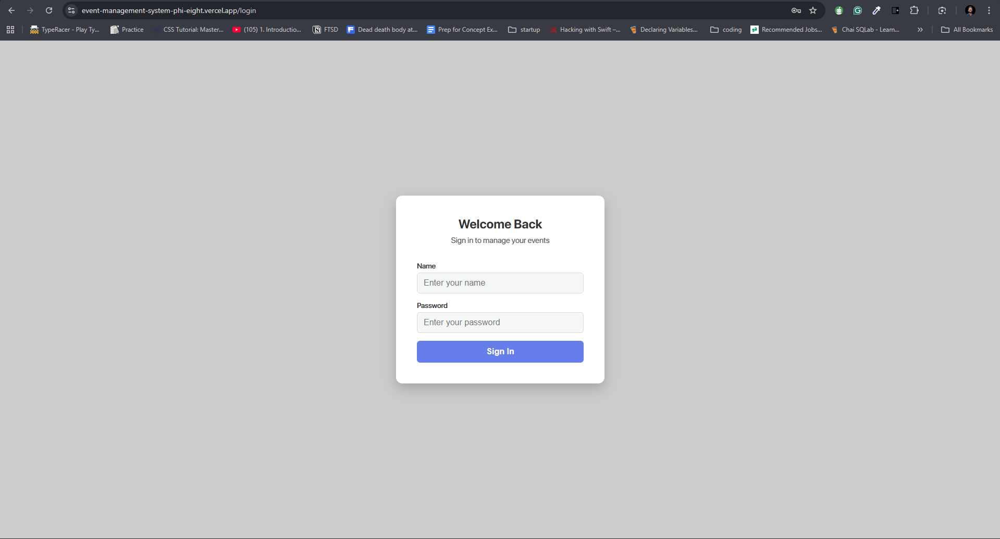
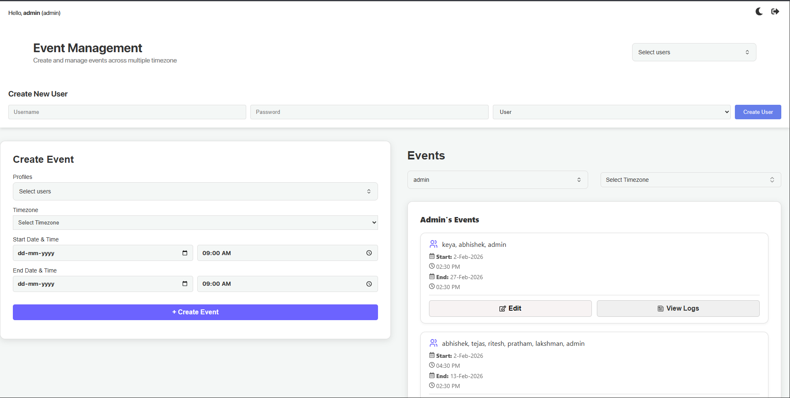
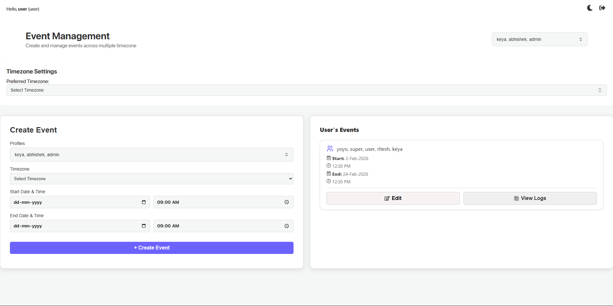
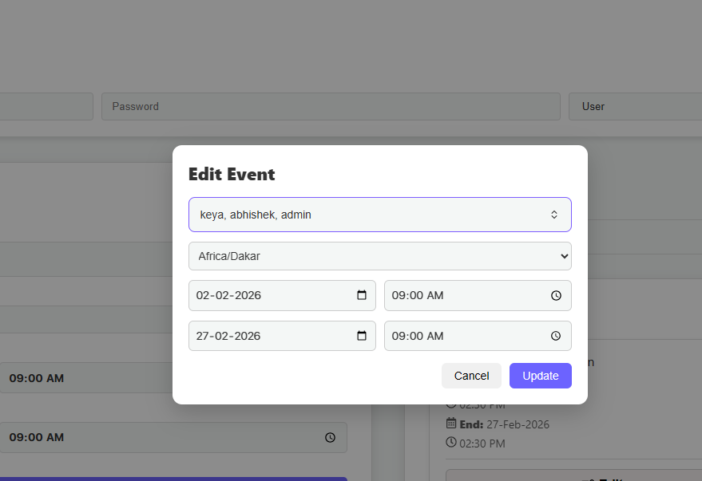
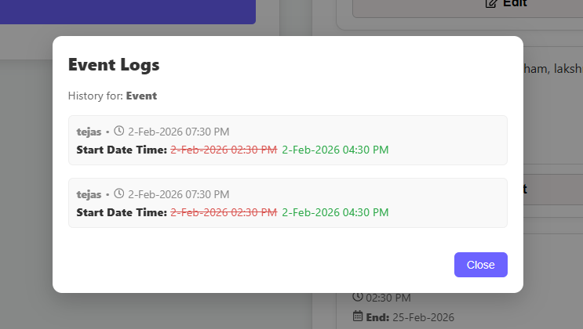

# Event Management System

## Introduction
The **Event Management System** is a robust full-stack web application designed to streamline the process of creating, scheduling, and managing events across multiple timezones. Tailored for efficiency, it features role-based access control (Admin & User), allowing administrators to manage all users and events while offering standard users a personalized dashboard for their scheduled activities. The application emphasizes usability with a responsive design, dark/light mode support, and comprehensive event logging to track updates and modifications.

## Project Type
Fullstack (MERN)

## Deployed App
*   **Live Demo**: https://event-management-system-phi-eight.vercel.app


## Directory Structure
```
Event-Management-System/
├─ client/              # Frontend (React + Vite)
│  ├─ src/
│  │  ├─ api/           # Axios instance configuration
│  │  ├─ components/    # Reusable UI components (CreateEvent, Heading, etc.)
│  │  ├─ context/       # React Context (Auth, Theme)
│  │  ├─ pages/         # Application Pages (Login, AdminDashboard, UserDashboard)
│  │  ├─ redux/         # Redux State Management
│  │  └─ ...
│  └─ ...
├─ server/              # Backend (Node.js + Express)
│  ├─ src/
│  │  ├─ controllers/   # Route Controllers
│  │  ├─ middleware/    # Auth & Admin Verification
│  │  ├─ models/        # Mongoose/MongoDB Models
│  │  ├─ routes/        # API Routes
│  │  └─ ...
│  └─ ...
└─ README.md            # Project Documentation
```

## Video Walkthrough of the project
<!-- Attach a very short video walkthrough of all of the features [ 1 - 3 minutes ] -->
[Link to Video 1 Placeholder]

## Video Walkthrough of the codebase
<!-- Attach a very short video walkthrough of codebase [ 1 - 5 minutes ] -->
[Link to Video 2 Placeholder]

## Features
*   **Role-Based Access Control (RBAC)**: Secure Login for Admins and regular Users with distinct dashboard views.
*   **Global Event Scheduling**: Create events with precise start/end times and specific timezones.
*   **Timezone Intelligence**: Automatic conversation and display of event times based on selected timezones.
*   **Event Logs**: Detailed history of changes made to an event (updates, edits).
*   **Dark/Light Mode**: fully responsive UI with a built-in theme toggler.
*   **Instant Updates**: Real-time state management ensuring new users and events appear immediately without page refreshes.
*   **Responsive Design**: Seamless experience across Desktop, Tablet, and Mobile devices.

## App Snapshots

### Login Page

*Secure login interface with role-based redirection.*

### Admin Dashboard

*Comprehensive admin controls for managing users and events.*

### User Dashboard

*Personalized view for users to track their scheduled events.*

### Edit Event

*Easy-to-use interface for modifying event details.*

### Event Logs

*Detailed history tracking of all event modifications.*

## Design Decisions & Assumptions
*   **Authentication**: We chose **JWT (JSON Web Tokens)** stored in HTTP-Only cookies for enhanced security against XSS attacks.
*   **State Management**: **Redux Toolkit** is used for handling profile data globally to ensure "Select Profiles" features are always in sync.
*   **Styling**: Pure **CSS** with CSS variables was chosen over frameworks like Tailwind for granular control over the "Premium" look and feel and Dark Mode implementation.
*   **Validation**: Frontend validation ensures start dates cannot be in the past and end dates must proceed start dates.

## Installation & Getting Started

### Prerequisites
*   Node.js (v14+)
*   MongoDB (Local or Atlas URI)

### Setup Steps

1.  **Clone the Repository**
    ```bash
    git clone  https://github.com/abhishekverma22/Event-Management-System.git
    cd Event-Management-System
    ```

2.  **Backend Setup**
    ```bash
    cd server
    npm install
    ```
    *   Create a `.env` file in the `server` directory:
        ```env
        PORT=8000
        MONGODB_URI=your_mongodb_connection_string
        JWT_SECRET=your_secret_key
        NODE_ENV=development
        CORS_ORIGIN=http://localhost:5173
        ```
    *   Start the server:
        ```bash
        npm run dev
        ```

3.  **Frontend Setup**
    ```bash
    cd client
    npm install
    ```
    *   Start the client:
        ```bash
        npm run dev
        ```

4.  **Access the App**
    *   Open your browser and navigate to `http://localhost:5173`.

## Usage

1.  **Login**: Use the credentials provided below to log in.
2.  **Admin Dashboard**:
    *   **Create New User**: Add new team members to the system.
    *   **Create Event**: Schedule events for specific users or yourself.
    *   **View Events**: See all events in the system.
     *   **Edit Events**: Edit events in the system.
     *   **See Event Logs**: See event logs of the events.
3.  **User Dashboard**:
    *   **My Events**: View events scheduled for you.
    *   **Create Event**: Schedule your own events with other member.
    *   **Edit Events**: Edit your own events.
    *   **See Event Logs**: See event logs of the events.

## Credentials

**Admin User**:
*   **Username**: `admin`
*   **Password**: `admin`

**Default  User**
*   **Username**: `user`
*   **Password**: `user`

## APIs Used
The application uses its own RESTful API served by the Express backend. No third-party public APIs are required for core functionality.

## API Endpoints

### Authentication
*   `POST /api/create-profile`: Register a new user (Admin only).
*   `POST /api/login`: Authenticate user and receive token.
*   `POST /api/logout`: Clear authentication cookie.

### Profiles
*   `GET /api/get-profile`: Retrieve all user profiles.

### Events
*   `POST /api/event/create-event`: Create a new scheduled event.
*   `GET /api/event/by-profile/:id`: Get all events associated with a specific user ID.
*   `PUT /api/event/update-event/:id`: Update event details (time, paticipants, timezone).
*   `GET /api/event/logs/:eventId`: Fetch change logs for a specific event.

## Technology Stack

### Frontend
*   **React.js**: Component-based UI library.
*   **Redux Toolkit**: State management.
*   **React Router DOM**: Navigation and routing.
*   **Axios**: HTTP client for API requests.
*   **Moment-Timezone**: Handling dates and timezones.

### Backend
*   **Node.js**: Runtime environment.
*   **Express.js**: Web server framework.
*   **MongoDB**: NoSQL Database.
*   **Mongoose**: ODM for MongoDB.
*   **Bcrypt.js**: Password hashing.
*   **JsonWebToken**: Secure authentication.


